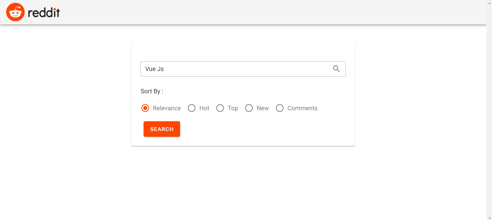
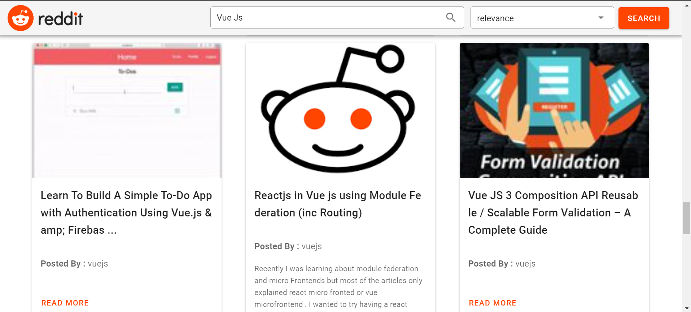

# Reddit Clone
This project is a REST API based search handler. In this project I have integrated Vue JS solution with Reddit API and getting reddit data on parameter based search.


## Project After being deployed on localhost:8080


## Project setup
Clone repository on your local and then run the below command which will install all the dependencies required for the project. Mostly dependies are built-in libraries nothing out of the box is installed as such.
```
npm install
```
Ones dependencies are installed , run below command to run the client server (Vue JS)
### Complie and deploy client server (Vue JS)
```
npm run serve
```

### Project is now deployed and can be access on below port
```
http://localhost:8080/
```
### Search Result on the WebPage


### Customize configuration
See [Configuration Reference](https://cli.vuejs.org/config/).
